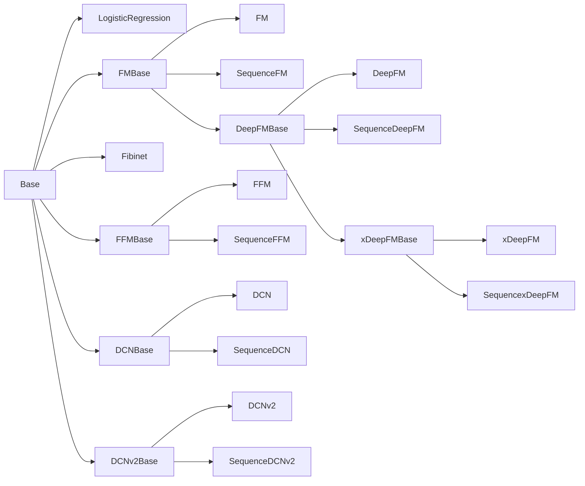

# Factorization Machine (FM) Models

This directory contains implementations of various Factorization Machine models and their extensions.

## Class Inheritance Structure

```mermaid
graph LR
    Base --> LogisticRegression
    Base --> FMBase
    Base --> Fibinet
    Base --> FFMBase
    Base --> DCNBase
    Base --> DCNv2Base

    FMBase --> FM
    FMBase --> SequenceFM
    FMBase --> DeepFMBase

    DeepFMBase --> DeepFM
    DeepFMBase --> SequenceDeepFM
    DeepFMBase --> xDeepFMBase

    xDeepFMBase --> xDeepFM
    xDeepFMBase --> SequencexDeepFM

    FFMBase --> FFM
    FFMBase --> SequenceFFM

    DCNBase --> DCN
    DCNBase --> SequenceDCN

    DCNv2Base --> DCNv2
    DCNv2Base --> SequenceDCNv2
```
